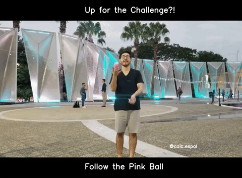
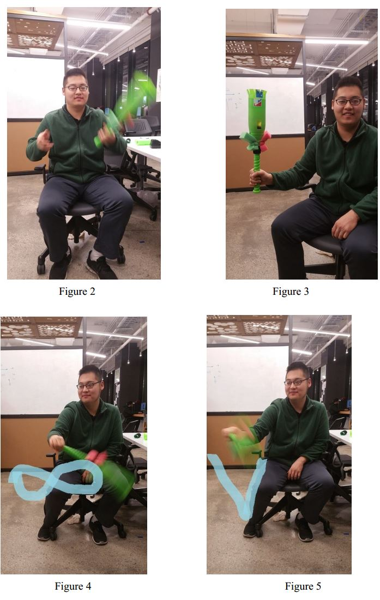
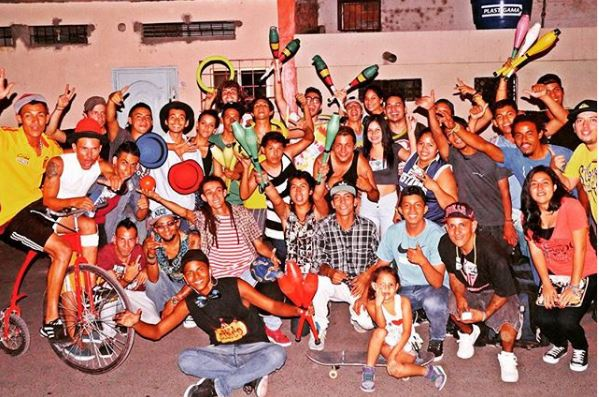

# JugglingLove
Compendium of Juggling Projects. 

 
    

[//]: # (-------------------Reference List------------------------------)
[//]: # (Image Directory Paths)
[image1]: ./README_images/off_lights.gif
[image2]: ./README_images/motion_sound.jpg
[image3]: ./README_images/disney_juggling.gif
[image4]: ./README_images/jmi.gif
[image5]: ./README_images/caic_team.jpg

[//]: # (Repo URL Links)
[link1]: https://github.com/laygond/Turn-OFF-The-Lights
[link2]: https://github.com/laygond/Transform-Motion-into-Sound-Effects
[link3]: https://github.com/laygond/DisneyJuggling
[link4]: https://github.com/laygond/Juggling-Machine-Interface
[link5]: https://www.instagram.com/caic.espol

# Projects
Click for Code

Turn OFF The Lights | Transform Motion into Sound Effects
:---:|:---:
 |  

Disney Juggling | Juggling Machine Interface
:---:|:---:
 |  

# CAIC Team
<b>C</b>lub de <b>A</b>rte e <b>I</b>nvestigacion <b>C</b>ircense (Art & Research Circus Club). Click on image and check our Instagram.

 
  

